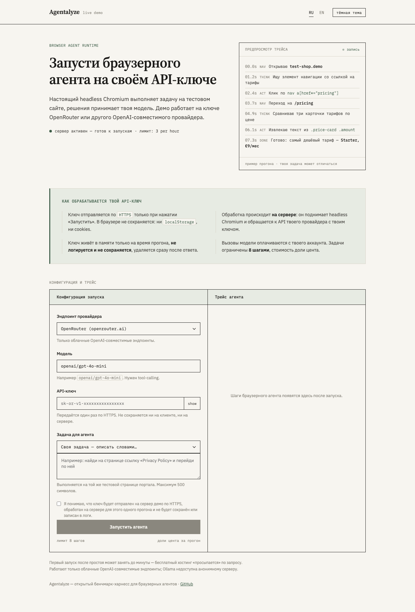

# Agentalyze

<!-- Если репозиторий живёт под другим аккаунтом — замените ilyat9 в URL бейджей ниже. -->
[](https://github.com/ilyat9/agentalyze/actions/workflows/ci.yml)
[](pyproject.toml)
[](.github/workflows/ci.yml)
[](https://github.com/astral-sh/ruff)
[](.github/workflows/ci.yml)
[](LICENSE.md)


<p align="center">
  <a href="https://agentalyze-demo.onrender.com/demo">
    <strong>🌐 Live demo — запусти браузерного агента на своём API-ключе</strong>
  </a>
</p>
<p align="center">
  <a href="https://agentalyze-demo.onrender.com/demo">
    
  </a>
</p>
<p align="center">
  <em>Настоящий headless Chromium выполняет задачу на тестовых HTML-фикстурах,
  решение принимает твоя модель. Ключ обрабатывается один раз и забывается
  (<a href="docs/DEMO_DEPLOYMENT.md">модель угроз</a>).
  <a href="docs/screenshots/demo-dark.png">Тёмная тема</a> ·
  <a href="docs/screenshots/demo-trace.png">трейс прогона</a>.</em>
</p>

---

Eval harness for LLM agents working with tools and a real browser. Вместо
абстрактных бенчмарков — suite из 30 конкретных агентных веб-задач
(заполнение форм, извлечение фактов с уверенностью, восстановление после
ошибок) на локальных HTML-фикстурах и реальном Chromium. Главный вопрос —
не «какой success rate», а **где именно ломается агент**: неверный выбор
инструмента, галлюцинация элемента, зацикливание, исчерпание шагов.

Ключевые свойства:

* **Честность важнее демо**: успех решает программный верификатор по
  финальному DOM, а не самооценка модели; каждый шаг трассируется в JSON —
  весь контекст, ответ модели, вызванный инструмент, результат действия,
  хэш DOM и скриншот.
* **Сравнение моделей на равных**: одни и те же задачи, одинаковые browser-инструменты,
  несколько провайдеров (любой OpenAI-совместимый API или локальная Ollama)
  в одном прогоне с отчётом по метрикам, цене и латентности.
* **Regression-режим для CI**: детект деградации между двумя прогонами
  с числовыми кодами выхода, пригодными для гейта в pull request.

Статус: **проект завершён** — история разработки в
[`docs/ROADMAP.md`](docs/ROADMAP.md). Известные границы применимости честно
собраны в [`docs/KNOWN_LIMITATIONS.md`](docs/KNOWN_LIMITATIONS.md).

<p align="center">
  
</p>

<p align="center">
  <em>Запуск одной задачи из CLI: ReAct-цикл в Chromium → программный верификатор → честный summary.<br>
  Демки сгенерированы <a href="https://github.com/charmbracelet/vhs">Charm VHS</a>
  (<a href="docs/tapes/">docs/tapes/</a>, регенерация — <code>scripts/gen_cli_demos.sh</code>);
  summary в демке — реплей настоящего прогона, не постановка.</em>
</p>

## Содержание

1. [Быстрый старт](#быстрый-старт)
2. [Архитектура](#архитектура)
3. [Task suite](#task-suite)
4. [Чем Agentalyze отличается от общих бенчмарков](#чем-agentalyze-отличается-от-общих-бенчмарков)
5. [Providers](#providers)
6. [Running evaluations](#running-evaluations)
7. [Regression checks / CI integration](#regression-checks--ci-integration)
8. [Docker](#docker)
9. [HTTP API / сервисный режим](#http-api--сервисный-режим) — incl. [🌐 live demo](https://agentalyze-demo.onrender.com/demo)
10. [Development](#development)
11. [Design decisions](#design-decisions)
12. [Roadmap / Status](#roadmap--status)
13. [Лицензия](#лицензия)

## Быстрый старт

Самый короткий путь к первому результату — Docker (Chromium уже внутри образа,
ставить Python и системные библиотеки не нужно):

```bash
git clone <repo-url> && cd agentalyze
cp providers.example.yaml providers.yaml      # укажите своих провайдеров

docker build -t agentalyze .
export OPENROUTER_API_KEY=sk-or-...           # ключ только в окружении, не в образе
agentalyze_run() {
  docker run --rm \
    -e OPENROUTER_API_KEY \
    -v "$(pwd)/results:/app/results" \
    -v "$(pwd)/providers.yaml:/app/providers.yaml:ro" \
    agentalyze "$@"
}

agentalyze_run tasks                          # список всех задач
agentalyze_run run --task form-fill-basic-01 --provider gpt-4o-mini-via-openrouter
```

Локальная установка (если нужен исходный код и тесты):

```bash
pip install -e ".[dev,browser]"
playwright install chromium
agentalyze run --task form-fill-basic-01 --provider gpt-4o-mini-via-openrouter
```

## Архитектура

Проект слоистый; каждый слой строился поверх предыдущих и ничего о них
не предполагал сверх явных интерфейсов:


Поток данных одной строкой: `Task + Provider → RunTrace → Metrics → Report`.
Аналитические слои (`analysis`, `orchestration`, `regression`) **ничего не
запускают** — они читают готовые
трейсы; поэтому всё это покрывается быстрыми тестами без браузера.

## Task suite

**30 задач, 6 категорий** (по 5 в каждой), каждая категория целится в
конкретный режим отказа:
`navigation`, `form_fill`, `extraction`, `multi_step`, `error_recovery`,
`distractor` (заманивалки: элементы, похожие на цель, но ею не являющиеся).

Полный список с идентификаторами:

```bash
agentalyze tasks                                # все задачи
agentalyze tasks --tag looping                  # только задачи, «ловящие» зацикливание
```

<p align="center">
  
</p>

Каждая задача несёт поле `expected_failure_modes` (теги из failure-таксономии)
— структурированный аналог её комментария «Reveals: …»; флаг `--tag`
фильтрует индекс по нему.

Как добавить новую задачу (три шага):

1. **HTML-фикстура** — `fixtures/<категория>/<имя>.html`. Самодостаточный
   файл без внешних зависимостей; корректность фикстур проверяется
   автоматически тестом `tests/tasks/test_fixtures_valid.py`.
2. **Запись в реестре** — `src/agentalyze/tasks/registry.py`: `id`
   (kebab-case), категория, заголовок, дословная инструкция агенту,
   относительный путь фикстуры, сложность (`easy`/`medium`/`hard`) и
   `verifier_id`.
3. **Верификатор** — переиспользуйте существующий из
   `src/agentalyze/tasks/verifiers.py` (`VERIFIERS`: маркер на странице,
   значение в тексте, подсчёт элементов, дата и т.п.) или напишите новый
   там же. Верификатор смотрит только на финальный DOM — никогда на шаги агента.

Задача становится доступной всем командам CLI сразу после записи в реестр.
Пошаговый чек-лист для контрибьюторов — включая «как придумать задачу под
конкретный failure mode» — вынесен в [`CONTRIBUTING.md`](CONTRIBUTING.md);
шаблон предложения новой задачи лежит в
[`.github/ISSUE_TEMPLATE/new_task_suite_case.md`](.github/ISSUE_TEMPLATE/new_task_suite_case.md).

## Чем Agentalyze отличается от общих бенчмарков

| | Agentalyze | AgentBench / WebArena / SWE-bench |
| --- | --- | --- |
| **Фокус** | узкий: веб-агент с инструментами на реальном Chromium | широкий/академический: десятки разнородных сред и датасетов |
| **Задачи** | 30 рукописных, каждая целится в конкретный failure mode | тысячи автоматически собранных инстансов |
| **Вердикт** | программный верификатор по финальному DOM — не самооценка модели | чаще эвристики/строковое сравнение ответа |
| **Диагностика** | failure-таксономия: *почему* сломалось (looping, галлюцинация элемента, premature done…) | обычно бинарный success/fail |
| **Калибровка** | ECE уверенности модели против верификатора | как правило отсутствует |
| **Regression в CI** | diff двух прогонов с exit-кодами для гейта PR | не входит в задачу |

Это не «лучше или хуже»: общие бенчмарки отвечают на вопрос «насколько силён
агент вообще», Agentalyze — «что именно делает мой агент и моя модель, и не
стало ли хуже после обновления». Второй вопрос существующие suite'ами
закрываются плохо, а он-то и возникает в production каждую неделю.

## Providers

Провайдеры описываются в `providers.yaml` (шаблон —
[`providers.example.yaml`](providers.example.yaml)). Файл **не содержит
секретов**: он лишь называет переменную окружения с ключом, так что его можно
коммитить. Поддерживаются два типа:

```yaml
providers:
  - name: gpt-4o-mini-via-openrouter
    kind: openai_compatible            # любой /v1/chat/completions API:
    base_url: https://openrouter.ai/api/v1
    api_key_env_var: OPENROUTER_API_KEY
    model_name: openai/gpt-4o-mini

  - name: llama31-8b-local
    kind: ollama                       # локальная Ollama, ключ не нужен
    model_name: llama3.1:8b            # base_url по умолчанию localhost:11434/v1
```

Если переменная с ключом не установлена, загрузка падает с понятной ошибкой.
Каждый провайдер автоматически обёрнут в retry (tenacity: до 3 попыток с
экспоненциальным backoff, только для сетевых/rate-limit ошибок; параметры —
секция `retry` per-provider). Стоимость считается опционально по таблице цен
([`pricing.example.yaml`](pricing.example.yaml)); без неё cost = N/A.

## Running evaluations

### Одна задача — `agentalyze run`

Раннер поднимает локальный HTTP-сервер фикстур и реальный Chromium, гоняет
ReAct-цикл (модель действует через browser-инструменты: `navigate`, `click`,
`type_text`, `select_option`, `submit_form`, `extract_text`, `wait_for`) до
вызова `done(...)`, после чего задачу верифицирует программный верификатор.

```bash
agentalyze run --task form-fill-basic-01 --provider gpt-4o-mini-via-openrouter
```

Пример вывода:

```
==============================================================
Task:       form-fill-basic-01 (Fill the contact form)
Provider:   gpt-4o-mini-via-openrouter
Outcome:    success
Steps:      6
Tokens:     prompt=3120 completion=210 cost=$0.0011
Verifier:   Success marker '#success-marker' is present and visible.
Wall time:  14.2s
Trace:      9f0c.../trace.json
==============================================================
```

Код выхода — `0` только при успехе. Артефакты складываются в
`AGENTALYZE_RESULTS_DIR` (по умолчанию `./results`):

```
results/<run_id>/trace.json              # полный машинночитаемый трейс (RunTrace)
results/<run_id>/screenshots/step_N.png  # скриншот страницы после каждого действия
```

Трейс самодостаточен: для каждого шага хранится весь контекст, отправленный
модели, её ответ, вызванный инструмент, результат действия, sha256-хэш DOM и
путь к скриншоту. Итог классифицируется в `RunOutcome`: `success`,
`failure_verifier`, `failure_max_steps`, `failure_timeout`,
`failure_provider_error`, `failure_tool_error`, `failure_crash`.

Полезные флаги: `--providers-config`, `--results-dir`, `--fixtures-dir`
(переопределяют соответствующие переменные окружения).

### Второй раннер: code-generation вместо tool-calling — `--agent-style code`

Помимо структурного tool-calling ReAct-цикла выше, есть опциональный второй
раннер на базе [`smolagents`](https://github.com/huggingface/smolagents)
`CodeAgent`: модель пишет короткий Python-код, вызывающий инструменты как
обычные функции (`click('e3')`), вместо structured JSON tool calls.
Реализация — тонкие адаптеры (`src/agentalyze/runner/code_agent/`) поверх тех
же `Provider`/browser-инструментов/`RunTrace`, что и основной раннер.

```bash
pip install -e ".[code-agent]"
agentalyze run --task nav-simple-link-01 --provider gpt-4o-mini-via-openrouter --agent-style code
agentalyze compare --all-tasks --providers gpt-4o-mini-via-openrouter --agent-style code
```

Трейсы обоих раннеров попадают в один и тот же формат `RunTrace` (новое поле
`agent_style`: `"tool_calling"` или `"code"`), проходят через один и тот же
`inspect`/failure-taxonomy/regression-check конвейер.

**Важно:** `AGENTALYZE_CODE_AGENT_EXECUTOR_TYPE` по умолчанию `local` —
smolagents' `LocalPythonExecutor` НЕ является security-sandbox (это
явно написано в его собственной документации). Режимы `docker`/`e2b`/
`modal`/`blaxel` сегодня не работают с браузерными инструментами этого
проекта вообще (подтверждено живым прогоном, не предположением) — подробности
и почему в [docs/KNOWN_LIMITATIONS.md](docs/KNOWN_LIMITATIONS.md#code-agent-runner-smolagents-codeagent).

Честный, вычисленный из реальных чисел (не смоделированный) прогон обоих
стилей на всех 30 задачах suite с детерминированным скриптовым
провайдером — [examples/code_agent_vs_tool_calling_report.md](examples/code_agent_vs_tool_calling_report.md).
Это не бенчмарк smolagents на их собственных задачах: другой набор задач,
другой домен, другая (гораздо меньшая) выборка — отчёт честно об этом
предупреждает и не переносит заявление «~30% меньше шагов» из документации
smolagents как факт про этот проект.

### Весь suite или подмножество — `agentalyze compare`

```bash
# Весь suite двумя провайдерами:
agentalyze compare --all-tasks --providers gpt-4o-mini-via-openrouter,llama31-8b-local

# Подмножество: по категории, по явному списку задач:
agentalyze compare --category navigation,error_recovery --providers llama31-8b-local
agentalyze compare --tasks nav-simple-link-01,form-fill-basic-01 --providers llama31-8b-local
```

Прогон идёт строго последовательно по умолчанию (комбинация «задача ×
провайдер» за комбинацией); начиная со второй комбинации строка прогресса
показывает ETA — простую линейную экстраполяцию по уже завершённым
комбинациям. Каждый трейс сохраняется на диск сразу — сбой в середине не
теряет готовые результаты. Перед стартом каждый провайдер проходит
health-check; нездоровый провайдер прерывает команду с явной ошибкой.
По завершении пишутся:

```
results/<suite_run_id>/suite_run.json   # машинночитаемая сводка + все трейсы
results/<suite_run_id>/report.md        # человекочитаемый отчёт
```

Полный пример сгенерированного отчёта (получен производственным конвейером
на синтетических данных — реальная модель не вызывалась):
[`examples/sample_report.md`](examples/sample_report.md). Рядом лежит
[`examples/real_run_report.md`](examples/real_run_report.md) — отчёт
**реального** прогона полного suite'а на локальной Ollama
(`qwen2.5:7b-instruct`, MacBook Air M2). Обратите внимание
на секцию «Honest conclusion»: лучший по success rate провайдер — не всегда
правильный выбор, и отчёт вычисляет это расхождение сам.

Пример фрагмента `report.md`:

```markdown
## Summary

| Provider | Tasks | Success rate | Avg cost / task | Avg steps | p50 latency | p95 latency |
| --- | ---: | ---: | ---: | ---: | ---: | ---: |
| `gpt-4o-mini-via-openrouter` | 30 | 83% | $0.0042 | 6.1 | 2.8s | 11.4s |
| `llama31-8b-local`           | 30 | 44% | $0.0000 | 11.7 | 5.9s | 24.3s |

> Стоимость `$0.0000` — это честный ноль локальной модели, а не «неизвестная цена».

## Breakdown by task category
### NAVIGATION (3 task(s))
...
```

### Параллельный прогон (`--max-concurrent`)

```bash
# До 3 комбинаций одновременно:
agentalyze compare --all-tasks --providers gpt-4o-mini-via-openrouter,llama31-8b-local --max-concurrent 3
```

`--max-concurrent N` (по умолчанию `1` = строго последовательно) запускает до
N комбинаций одновременно под `asyncio.Semaphore`. Каждая комбинация полностью
изолирована: свой браузерный контекст Chromium, свой fixture-сервер на
свободном порту, свой каталог артефактов `results/<run_id>/` — общего состояния
нет. Промежуточное сохранение снапшота сериализуется через `asyncio.Lock`,
так что параллельные завершения не теряют и не дублируют результаты.

Когда уместно повышать: облачные провайдеры с лимитом запросов (параллельные
комбинации чаще упираются в rate limit — существующий retry это поглощает,
но попытки не бесплатны) и локальный ресурс: каждая незавершённая комбинация
держит реальный экземпляр Chromium + открытые соединения к провайдеру.
Разумные значения — 2–4; больше имеет смысл только на мощной машине и при
высоком rate limit провайдера.

Отчёт также содержит разбивку отказов по тегам таксономии, калибровку
уверенности и секцию «Honest conclusion» (включая предупреждения о малых
выборках). Разобрать конкретные неудачи помогает:

```bash
agentalyze inspect --suite-run <id> --tag looping          # только зацикливания
agentalyze inspect --suite-run <id> --outcome failure_verifier
```

## Regression checks / CI integration

Regression-режим сравнивает два suite-прогона по задачам и провайдерам:
success rate, число шагов, латентность, стоимость. Статусы различий на задачу:
`regressed`, `fixed`, `unchanged`, `newly_added`, `removed`.

```bash
# Пометить известный хороший прогон как baseline (указатель хранится в results/):
agentalyze set-baseline --suite-run <suite_run_id>

# Сверить новый прогон с baseline (или любым указанным):
agentalyze regression-check --baseline <baseline_suite_run_id> --new <new_suite_run_id>

# Опционально: структурный diff трейсов конкретной регрессировавшей задачи
# (run id — индивидуальные трейсы из `inspect --suite-run`):
agentalyze inspect --diff-trace <baseline_run_id> <new_run_id> [--output diff.txt]
```

#### Автоматический baseline (`--baseline auto`) — удобство, не замена

```bash
agentalyze regression-check --baseline auto --new <new_suite_run_id>
```

Каждый `regression-check` дописывает одну строку в append-only журнал
`results/baseline_journal.jsonl`
(`{suite_run_id, timestamp, was_clean_at_promotion_time}`). `--baseline auto`
берёт из журнала **последний прогон, чья последняя сверка была чистой**
(`regressed_count == 0` относительно своего baseline на момент прогона) — не
просто последний по времени. Это удобство для быстрой локальной итерации.

Для CI-гейта рекомендуемым способом остаётся осознанный выбор точки отсчёта:
`set-baseline` или явный `--baseline <id>`, зафиксированный в конфигурации job.
Авто-режим молча сместит базу сравнения вслед за историей и может замаскировать
медленную деградацию («зелёная цепочка» относительно скользящей базы). Если
подходящего чистого прогона нет (например, это самые первые прогоны проекта),
команда завершается с кодом `2` и понятным сообщением, не падая с трейсбеком.

Коды возврата (закреплены тестами, load-bearing для CI):

| Код | Значение |
| --- | --- |
| `0` | регрессий нет (или передан `--allow-regressions`) |
| `1` | есть регрессии → шаг CI должен упасть |
| `2` | проблема конфигурации (неизвестный run id, baseline не задан) |

Отчёт сохраняется в `results/<new_suite_run_id>/regression_report.json`.

Исторически шумные задачи (флейки верификатора, чувствительные к таймингу
фикстуры) можно исключить из подсчёта регрессий опциональным файлом
`regression.yaml` (шаблон — [`regression.example.yaml`](regression.example.yaml)):
пары таких задач остаются в diff с явной пометкой «excluded from gate», но не
влияют на `regressed_count` и код возврата. Файл не обязателен: без него
гейт работает как раньше. Путь можно переопределить флагом `--regression-config`
или переменной `AGENTALYZE_REGRESSION_CONFIG_PATH`.

Готовый шаблон workflow для pull request —
[`.github/workflows/regression-check.yml.example`](.github/workflows/regression-check.yml.example).
Расширение `.example` намеренное: job требует реального платного провайдера,
поэтому он активируется вручную (`git mv ... .yml`, добавить секрет с API-ключом,
зафиксировать baseline run id) — см. комментарии в самом файле. Автоматический CI
проекта (`.github/workflows/ci.yml`) платных вызовов не делает никогда.

#### Структурный diff трейсов (`inspect --diff-trace`)

Числовой diff `regression-check` говорит **что** ухудшилось; `--diff-trace`
показывает **где именно** разошлось поведение агента:

```bash
agentalyze inspect --diff-trace <baseline_run_id> <new_run_id>
```

Шаги двух трейсов одной пары «задача × провайдер» сопоставляются по номеру;
для каждой пары шагов выводится: тот же инструмент или другой, тот же исход
(`success`/`fail`) инструмента или другой, изменилось ли состояние страницы
(`dom_snapshot_hash`) иначе, чем в baseline. Разная длина последовательностей
обрабатывается явно («шаги только в baseline/new»). Итог — точное указание
**первого номера шага с расхождением**. Отчёт намеренно не интерпретирует
*почему* поведение изменилось: это была бы непроверяемая эвристика; разбор
причины — за человеком, начиная с указанного шага и полных `trace.json`.


## Docker

### Сборка и запуск

```bash
docker build -t agentalyze .
docker run --rm agentalyze --help          # ENTRYPOINT = agentalyze
```

Ключевые свойства образа:

* База — официальный образ Playwright для Python: Chromium и все его системные
  библиотеки уже внутри, ничего доустанавливать не нужно.
* **Секреты не встраиваются**: `providers.yaml` называет только переменные
  окружения; реальные ключи передаются в момент запуска:
  ```bash
  docker run --rm -e OPENROUTER_API_KEY agentalyze compare ...
  # или: docker run --rm --env-file .env agentalyze compare ...
  ```
* **Результаты — на volume**, иначе пропадут вместе с контейнером:
  ```bash
  docker run --rm \
    -v $(pwd)/results:/app/results \
    -v $(pwd)/providers.yaml:/app/providers.yaml:ro \
    -e OPENROUTER_API_KEY \
    agentalyze compare --providers gpt-4o-mini-via-openrouter --category navigation
  ```
* HTML-фикстуры задач запечены в образ (`AGENTALYZE_FIXTURES_DIR=/app/fixtures`),
  поэтому `run`/`compare` работают из контейнера без дополнительных монтирований.

### docker-compose с Ollama (локальная модель vs облачная)

[`docker-compose.yml`](docker-compose.yml) поднимает два сервиса: `agentalyze`
(CLI по требованию) и `ollama` с персистентным volume под модели:

```bash
cp providers.example.yaml providers.yaml   # и укажите base_url: http://ollama:11434/v1
docker compose up -d ollama                # сам агент при этом НЕ стартует
docker compose run --rm ollama ollama pull llama3.1:8b
docker compose run --rm agentalyze compare \
    --providers gpt-4o-mini-via-openrouter,llama31-8b-local --category navigation
```

**Важно про сеть:** внутри сети compose Ollama доступна контейнеру agentalyze
по имени сервиса — `http://ollama:11434/v1`, а **не**
`http://localhost:11434/v1` (localhost внутри контейнера — это сам контейнер).
Это самая частая путаница при переходе от локального запуска к
контейнеризированному. Готовый скрипт всего сценария «облако vs локальная
модель», включая regression-check на двух прогонах:
[`examples/compare_local_vs_cloud.sh`](examples/compare_local_vs_cloud.sh).

## HTTP API / сервисный режим

Помимо CLI, Agentalyze поднимается как HTTP-сервис для нескольких
одновременных клиентов: `POST /runs` (фоновый запуск suite-прогона),
`GET /runs/{id}` (статус), `GET /runs/{id}/report` (Markdown/HTML),
`POST /regression-check`, глубокий `GET /health` и Prometheus `/metrics`.
API — тонкий слой поверх тех же функций, что использует CLI: бизнес-логика
одна, оба режима продолжают работать.

```bash
pip install -e ".[api]"                       # сервисные зависимости (опциональны)
agentalyze create-api-key --name my-client    # ключ показывается один раз
agentalyze serve --host 0.0.0.0 --port 8000

curl -X POST http://localhost:8000/runs \
     -H "Authorization: Bearer agt-..." \
     -H "Content-Type: application/json" \
     -d '{"provider_names": ["gpt-4o-mini-via-openrouter"],
          "task_ids": ["nav-simple-link-01"]}'
```

Метаданные прогонов живут в БД (SQLite по умолчанию, PostgreSQL для
конкурентной записи; alembic-миграции накатываются при старте), ключи API
хранятся хэшированными (scrypt), rate-limit на запуски — slowapi,
структурные JSON-логи — structlog. Опционально секреты берутся из Vault
(дефолт — переменные окружения, как раньше). Полный продакшн-гид:
[`docs/DEPLOYMENT.md`](docs/DEPLOYMENT.md); модель угроз и известные риски:
[`docs/SECURITY_REVIEW.md`](docs/SECURITY_REVIEW.md).

Локальный сервисный стенд с PostgreSQL: `docker compose -f
docker-compose.service.yml up -d --build`. Kubernetes-манифесты: `deploy/k8s/`.

### Публичное демо (BYOK, опционально)

> **🌐 Демо задеплоено и доступно онлайн: [agentalyze-demo.onrender.com/demo](https://agentalyze-demo.onrender.com/demo)**
> Вставь свой OpenRouter/OpenAI-ключ, выбери задачу и запусти реального
> браузерного агента прямо в браузере (доли цента за прогон с твоего аккаунта).

Отдельная, выключенная по умолчанию поверхность для публичного
демо-сайта: посетитель вставляет **свой** OpenRouter/OpenAI ключ, выбирает
одну из трёх коротких задач (или описывает свою) и смотрит честный прогон
в реальном Chromium (ключ живёт в памяти одного запроса, не логируется,
не сохраняется; rate-limit по IP; allowlist из 3 `easy`-задач).

```bash
agentalyze serve --port 8000 --demo-mode   # или AGENTALYZE_DEMO_MODE_ENABLED=1
# → http://localhost:8000/demo
```

Живой деплой работает на split-архитектуре (0 ₽, без карты): FastAPI-оркестратор
на Render Free (slim-образ `Dockerfile.demo`, ~560 MB, без локального Chromium) +
headless Chromium как облачный browser-as-a-service (Browserless, `connect_over_cdp`)
+ LLM-вызовы напрямую на провайдера посетителя. Модель угроз, деплой на бесплатный
хостинг (Render + remote browser) и гарантии по ключу:
[`docs/DEMO_DEPLOYMENT.md`](docs/DEMO_DEPLOYMENT.md). Обычный self-hosted
`agentalyze serve` без этого флага демо-эндпоинты **не** открывает.

## Development

```bash
python3.11+ -m venv .venv && source .venv/bin/activate
pip install -e ".[dev,browser]"
playwright install chromium
# Опционально, для второго (code-generation) раннера:
pip install -e ".[code-agent]"
```

Тесты разделены маркерами (заданы в `pyproject.toml`):

```bash
pytest -m "not browser and not requires_ollama and not e2e_live"  # быстрые: доли секунды… минуты
pytest -m browser                                                 # реальный Chromium
pytest -m requires_ollama                                         # живой Ollama на :11434
pytest -m e2e_live                                                # реальная модель + Chromium (редко!)
pytest                                                            # = первый вариант (addopts)
```

Линтеры: `ruff check .` и `mypy src` (strict, как в CI) — оба должны проходить
чисто.

Анимированные CLI-демки в README — сгенерированные артефакты, их не правят
руками. Если поменялось что-то, что видно в выводе CLI (реестр задач,
формат summary, текст help), перегенерируйте:

```bash
brew install vhs          # один раз (тянет ffmpeg и ttyd)
scripts/gen_cli_demos.sh  # пересобирает docs/assets/cli-*.gif из docs/tapes/*.tape
```

Структура репозитория:

```
src/agentalyze/
├── config.py            # Settings (pydantic-settings, env AGENTALYZE_*)
├── tasks/               # реестр 30 задач, фикстур-сервер, верификаторы
├── providers/           # openai_compatible + ollama, factory, retry
├── runner/              # ReAct-цикл, browser-инструменты, трейс, CLI
├── analysis/            # failure-таксономия, метрики, калибровка, цены
├── orchestration/       # suite-runner, report.md, compare/inspect
└── regression/          # diff прогонов, baseline, regression-check
tests/                   # pytest; маркеры browser / requires_ollama / e2e_live
fixtures/                # локальные HTML-фикстуры по категориям
examples/                # end-to-end сценарий (Docker + Ollama) + sample_report.md
                         # с генератором generate_sample_report.py
docs/assets/             # анимированные демки CLI (GIF из VHS) + статический SVG
docs/tapes/              # исходники VHS-демок; регенерация: scripts/gen_cli_demos.sh
.github/workflows/       # ci.yml (lint/test/docker); regression-check.yml.example
.github/ISSUE_TEMPLATE/  # шаблон предложения новой задачи для suite
CONTRIBUTING.md          # как добавить новую задачу: чек-лист контрибьютора
providers.example.yaml   # шаблон конфигурации провайдеров (без секретов)
pricing.example.yaml     # шаблон таблицы цен для расчёта стоимости
```

Конфигурация — переменные окружения с префиксом `AGENTALYZE_` (+ опциональный
`.env`): `AGENTALYZE_FIXTURES_DIR` (`./fixtures`), `AGENTALYZE_RESULTS_DIR`
(`./results`), `AGENTALYZE_PROVIDERS_CONFIG_PATH` (`./providers.yaml`),
`AGENTALYZE_LOG_LEVEL` (`INFO`).

## Design decisions

Шесть архитектурных решений, которые проще прочитать сразу, чем откапывать
по коду (ссылки ведут на конкретные строки):

1. **Верификатор — строго постфактум и только по DOM**
   ([`tasks/verifiers.py:1–11`](src/agentalyze/tasks/verifiers.py#L1-L11)).
   Верификатор получает уже открытый `Page` в финальном состоянии и отвечает
   на один вопрос «достигнут ли ожидаемый DOM». Он никогда не смотрит шаги
   агента: разбор *как* агент шёл к результату — задача отдельного слоя
   таксономии отказов (слой `analysis`). Это устраняет соблазн «верификации по
   самооценке модели» на уровне типов.

2. **OllamaProvider — обёртка, а не дублирование**
   ([`providers/ollama.py:1–15`](src/agentalyze/providers/ollama.py#L1-L15)).
   Современная Ollama совместима с OpenAI API по формату сообщений и
   tool-calling'а, поэтому наследование от `OpenAICompatibleProvider` с
   переопределением только `health_check` (проверяет `/api/tags` и наличие
   конкретной модели локально) — осознанный выбор: дублировать маппинг было
   бы architectural mistake.

3. **Epsilon-коррекция бинов калибровки**
   ([`analysis/calibration.py:27–34`](src/agentalyze/analysis/calibration.py#L27-L34)).
   `0.29 * 10` в float — это `28.999…996`, и наивный `floor` уронил бы
   значение в соседний бин. Сдвиг на `1e-12` перед floor чинит край бина,
   оставаясь на много порядков меньше любого реального расстояния между
   отчетаемыми confidences.

4. **«Honest conclusion» считается программно, а не генерируется LLM**
   ([`orchestration/report.py:8–14`](src/agentalyze/orchestration/report.py#L8-L14)
   и [`83–89`](src/agentalyze/orchestration/report.py#L83-L89)).
   Расхождение «лучший в таблице ≠ правильный выбор» вычисляется из чисел
   этого прогона фиксированными шаблонами с детерминированным tie-break'ом.
   Инструмент, смысл которого — честная отчётность, не может доверять выводы
   языковой модели: это было бы одновременно иронично и ненадёжно.

5. **Отчёт честен о статистике своих же цифр**
   ([`report.py:28–31`](src/agentalyze/orchestration/report.py#L28-L31),
   [`calibration.py:22–25`](src/agentalyze/analysis/calibration.py#L22-L25)).
   Категория из <5 задач помечается предупреждением о малой выборке прямо в
   таблице; ECE вообще не печатается, если непустых бинов меньше трёх —
   «точность в одном бакете уверенности» не выдаётся за калибровку.

6. **Suite-runner устойчив к сбоям и персистит инкрементально**
   ([`orchestration/suite_runner.py`](src/agentalyze/orchestration/suite_runner.py)).
   Падение одной комбинации не роняет прогон, а после каждой завершённой
   комбинации полный снапшот переписывается на диск: крах на середине
   многочасового прогона не теряет часы результатов. По умолчанию комбинации
   идут строго последовательно (`max_concurrent=1`, безопасное поведение);
   опциональный bounded-parallel режим ограничивает параллелизм семафором и
   сериализует запись снапшота через `asyncio.Lock` — изоляция комбинаций
   гарантируется контрактом раннера (свой браузер, свой fixture-сервер,
   свой каталог артефактов на каждую комбинацию).

Бонусом — почему перцентили считаются nearest-rank, а не интерполяцией:
[`analysis/metrics.py:68–78`](src/agentalyze/analysis/metrics.py#L68-L78).

## Roadmap / Status

Проект развивался инкрементально — от ядра (задачи, провайдеры, раннер) к
аналитике и CI-интеграции; каждая веха оставляла рабочую, покрытую тестами
версию. История разработки сохранена в
[`docs/ROADMAP.md`](docs/ROADMAP.md); сегодня всё перечисленное там
реализовано. Честный список границ применимости и известных
упрощений — [`docs/KNOWN_LIMITATIONS.md`](docs/KNOWN_LIMITATIONS.md).

## Лицензия

MIT — см. [`LICENSE.md`](LICENSE.md).

