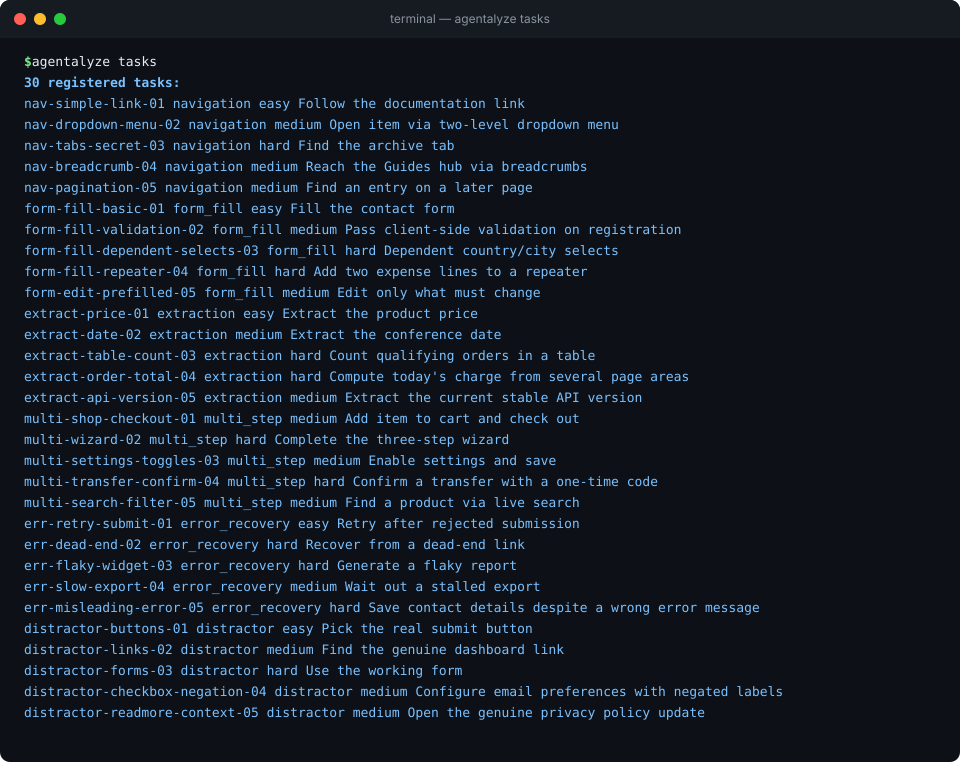
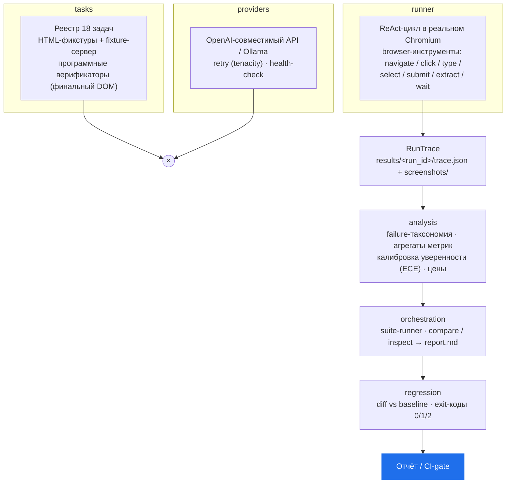

# Agentalyze

<!-- Если репозиторий живёт под другим аккаунтом — замените ilyat9 в URL бейджей ниже. -->
[](https://github.com/ilyat9/agentalyze/actions/workflows/ci.yml)
[](pyproject.toml)
[](.github/workflows/ci.yml)
[](https://github.com/astral-sh/ruff)
[](.github/workflows/ci.yml)
[](LICENSE.md)




Eval harness for LLM agents working with tools and a real browser. Вместо
абстрактных бенчмарков — suite из 18 конкретных агентных веб-задач
(заполнение форм, извлечение фактов с уверенностью, восстановление после
ошибок) на локальных HTML-фикстурах и реальном Chromium. Главный вопрос —
не «какой success rate», а **где именно ломается агент**: неверный выбор
инструмента, галлюцинация элемента, зацикливание, исчерпание шагов.

Ключевые свойства:

* **Честность важнее демо**: успех решает программный верификатор по
  финальному DOM, а не самооценка модели; каждый шаг трассируется в JSON —
  весь контекст, ответ модели, вызванный инструмент, результат действия,
  хэш DOM и скриншот.
* **Сравнение моделей на равных**: одни и те же задачи, одинаковые browser-инструменты,
  несколько провайдеров (любой OpenAI-совместимый API или локальная Ollama)
  в одном прогоне с отчётом по метрикам, цене и латентности.
* **Regression-режим для CI**: детект деградации между двумя прогонами
  с числовыми кодами выхода, пригодными для гейта в pull request.

Статус: **проект завершён** — история разработки в
[`docs/ROADMAP.md`](docs/ROADMAP.md). Известные границы применимости честно
собраны в [`docs/KNOWN_LIMITATIONS.md`](docs/KNOWN_LIMITATIONS.md).

## Содержание

1. [Быстрый старт](#быстрый-старт)
2. [Архитектура](#архитектура)
3. [Task suite](#task-suite)
4. [Чем Agentalyze отличается от общих бенчмарков](#чем-agentalyze-отличается-от-общих-бенчмарков)
5. [Providers](#providers)
6. [Running evaluations](#running-evaluations)
7. [Regression checks / CI integration](#regression-checks--ci-integration)
8. [Docker](#docker)
9. [Development](#development)
10. [Design decisions](#design-decisions)
11. [Roadmap / Status](#roadmap--status)
12. [Лицензия](#лицензия)

## Быстрый старт

Самый короткий путь к первому результату — Docker (Chromium уже внутри образа,
ставить Python и системные библиотеки не нужно):

```bash
git clone <repo-url> && cd agentalyze
cp providers.example.yaml providers.yaml      # укажите своих провайдеров

docker build -t agentalyze .
export OPENROUTER_API_KEY=sk-or-...           # ключ только в окружении, не в образе
agentalyze_run() {
  docker run --rm \
    -e OPENROUTER_API_KEY \
    -v "$(pwd)/results:/app/results" \
    -v "$(pwd)/providers.yaml:/app/providers.yaml:ro" \
    agentalyze "$@"
}

agentalyze_run tasks                          # список всех задач
agentalyze_run run --task form-fill-basic-01 --provider gpt-4o-mini-via-openrouter
```

Локальная установка (если нужен исходный код и тесты):

```bash
pip install -e ".[dev,browser]"
playwright install chromium
agentalyze run --task form-fill-basic-01 --provider gpt-4o-mini-via-openrouter
```

## Архитектура

Проект слоистый; каждый слой строился поверх предыдущих и ничего о них
не предполагал сверх явных интерфейсов:



Поток данных одной строкой: `Task + Provider → RunTrace → Metrics → Report`.
Аналитические слои (`analysis`, `orchestration`, `regression`) **ничего не
запускают** — они читают готовые
трейсы; поэтому всё это покрывается быстрыми тестами без браузера.

## Task suite

**18 задач, 6 категорий**, каждая категория целится в конкретный режим отказа:
`navigation`, `form_fill`, `extraction`, `multi_step`, `error_recovery`,
`distractor` (заманивалки: элементы, похожие на цель, но ею не являющиеся).

Полный список с идентификаторами:

```bash
agentalyze tasks
```

Как добавить новую задачу (три шага):

1. **HTML-фикстура** — `fixtures/<категория>/<имя>.html`. Самодостаточный
   файл без внешних зависимостей; корректность фикстур проверяется
   автоматически тестом `tests/tasks/test_fixtures_valid.py`.
2. **Запись в реестре** — `src/agentalyze/tasks/registry.py`: `id`
   (kebab-case), категория, заголовок, дословная инструкция агенту,
   относительный путь фикстуры, сложность (`easy`/`medium`/`hard`) и
   `verifier_id`.
3. **Верификатор** — переиспользуйте существующий из
   `src/agentalyze/tasks/verifiers.py` (`VERIFIERS`: маркер на странице,
   значение в тексте, подсчёт элементов, дата и т.п.) или напишите новый
   там же. Верификатор смотрит только на финальный DOM — никогда на шаги агента.

Задача становится доступной всем командам CLI сразу после записи в реестр.
Пошаговый чек-лист для контрибьюторов — включая «как придумать задачу под
конкретный failure mode» — вынесен в [`CONTRIBUTING.md`](CONTRIBUTING.md);
шаблон предложения новой задачи лежит в
[`.github/ISSUE_TEMPLATE/new_task_suite_case.md`](.github/ISSUE_TEMPLATE/new_task_suite_case.md).

## Чем Agentalyze отличается от общих бенчмарков

| | Agentalyze | AgentBench / WebArena / SWE-bench |
| --- | --- | --- |
| **Фокус** | узкий: веб-агент с инструментами на реальном Chromium | широкий/академический: десятки разнородных сред и датасетов |
| **Задачи** | 18 рукописных, каждая целится в конкретный failure mode | тысячи автоматически собранных инстансов |
| **Вердикт** | программный верификатор по финальному DOM — не самооценка модели | чаще эвристики/строковое сравнение ответа |
| **Диагностика** | failure-таксономия: *почему* сломалось (looping, галлюцинация элемента, premature done…) | обычно бинарный success/fail |
| **Калибровка** | ECE уверенности модели против верификатора | как правило отсутствует |
| **Regression в CI** | diff двух прогонов с exit-кодами для гейта PR | не входит в задачу |

Это не «лучше или хуже»: общие бенчмарки отвечают на вопрос «насколько силён
агент вообще», Agentalyze — «что именно делает мой агент и моя модель, и не
стало ли хуже после обновления». Второй вопрос существующие suite'ами
закрываются плохо, а он-то и возникает в production каждую неделю.

## Providers

Провайдеры описываются в `providers.yaml` (шаблон —
[`providers.example.yaml`](providers.example.yaml)). Файл **не содержит
секретов**: он лишь называет переменную окружения с ключом, так что его можно
коммитить. Поддерживаются два типа:

```yaml
providers:
  - name: gpt-4o-mini-via-openrouter
    kind: openai_compatible            # любой /v1/chat/completions API:
    base_url: https://openrouter.ai/api/v1
    api_key_env_var: OPENROUTER_API_KEY
    model_name: openai/gpt-4o-mini

  - name: llama31-8b-local
    kind: ollama                       # локальная Ollama, ключ не нужен
    model_name: llama3.1:8b            # base_url по умолчанию localhost:11434/v1
```

Если переменная с ключом не установлена, загрузка падает с понятной ошибкой.
Каждый провайдер автоматически обёрнут в retry (tenacity: до 3 попыток с
экспоненциальным backoff, только для сетевых/rate-limit ошибок; параметры —
секция `retry` per-provider). Стоимость считается опционально по таблице цен
([`pricing.example.yaml`](pricing.example.yaml)); без неё cost = N/A.

## Running evaluations

### Одна задача — `agentalyze run`

Раннер поднимает локальный HTTP-сервер фикстур и реальный Chromium, гоняет
ReAct-цикл (модель действует через browser-инструменты: `navigate`, `click`,
`type_text`, `select_option`, `submit_form`, `extract_text`, `wait_for`) до
вызова `done(...)`, после чего задачу верифицирует программный верификатор.

```bash
agentalyze run --task form-fill-basic-01 --provider gpt-4o-mini-via-openrouter
```

Пример вывода:

```
==============================================================
Task:       form-fill-basic-01 (Fill the contact form)
Provider:   gpt-4o-mini-via-openrouter
Outcome:    success
Steps:      6
Tokens:     prompt=3120 completion=210 cost=$0.0011
Verifier:   Success marker '#success-marker' is present and visible.
Wall time:  14.2s
Trace:      9f0c.../trace.json
==============================================================
```

Код выхода — `0` только при успехе. Артефакты складываются в
`AGENTALYZE_RESULTS_DIR` (по умолчанию `./results`):

```
results/<run_id>/trace.json              # полный машинночитаемый трейс (RunTrace)
results/<run_id>/screenshots/step_N.png  # скриншот страницы после каждого действия
```

Трейс самодостаточен: для каждого шага хранится весь контекст, отправленный
модели, её ответ, вызванный инструмент, результат действия, sha256-хэш DOM и
путь к скриншоту. Итог классифицируется в `RunOutcome`: `success`,
`failure_verifier`, `failure_max_steps`, `failure_timeout`,
`failure_provider_error`, `failure_tool_error`, `failure_crash`.

Полезные флаги: `--providers-config`, `--results-dir`, `--fixtures-dir`
(переопределяют соответствующие переменные окружения).

### Весь suite или подмножество — `agentalyze compare`

```bash
# Весь suite двумя провайдерами:
agentalyze compare --all-tasks --providers gpt-4o-mini-via-openrouter,llama31-8b-local

# Подмножество: по категории, по явному списку задач:
agentalyze compare --category navigation,error_recovery --providers llama31-8b-local
agentalyze compare --tasks nav-simple-link-01,form-fill-basic-01 --providers llama31-8b-local
```

Прогон идёт строго последовательно (комбинация «задача × провайдер» за
комбинацией), каждый трейс сохраняется на диск сразу — сбой в середине не
теряет готовые результаты. Перед стартом каждый провайдер проходит
health-check; нездоровый провайдер прерывает команду с явной ошибкой.
По завершении пишутся:

```
results/<suite_run_id>/suite_run.json   # машинночитаемая сводка + все трейсы
results/<suite_run_id>/report.md        # человекочитаемый отчёт
```

Полный пример сгенерированного отчёта (получен производственным конвейером
на синтетических данных — реальная модель не вызывалась):
[`examples/sample_report.md`](examples/sample_report.md). Обратите внимание
на секцию «Honest conclusion»: лучший по success rate провайдер — не всегда
правильный выбор, и отчёт вычисляет это расхождение сам.

Пример фрагмента `report.md`:

```markdown
## Summary

| Provider | Tasks | Success rate | Avg cost / task | Avg steps | p50 latency | p95 latency |
| --- | ---: | ---: | ---: | ---: | ---: | ---: |
| `gpt-4o-mini-via-openrouter` | 18 | 83% | $0.0042 | 6.1 | 2.8s | 11.4s |
| `llama31-8b-local`           | 18 | 44% | $0.0000 | 11.7 | 5.9s | 24.3s |

> Стоимость `$0.0000` — это честный ноль локальной модели, а не «неизвестная цена».

## Breakdown by task category
### NAVIGATION (3 task(s))
...
```

Отчёт также содержит разбивку отказов по тегам таксономии, калибровку
уверенности и секцию «Honest conclusion» (включая предупреждения о малых
выборках). Разобрать конкретные неудачи помогает:

```bash
agentalyze inspect --suite-run <id> --tag looping          # только зацикливания
agentalyze inspect --suite-run <id> --outcome failure_verifier
```

## Regression checks / CI integration

Regression-режим сравнивает два suite-прогона по задачам и провайдерам:
success rate, число шагов, латентность, стоимость. Статусы различий на задачу:
`regressed`, `fixed`, `unchanged`, `newly_added`, `removed`.

```bash
# Пометить известный хороший прогон как baseline (указатель хранится в results/):
agentalyze set-baseline --suite-run <suite_run_id>

# Сверить новый прогон с baseline (или любым указанным):
agentalyze regression-check --baseline <baseline_suite_run_id> --new <new_suite_run_id>
```

Коды возврата (закреплены тестами, load-bearing для CI):

| Код | Значение |
| --- | --- |
| `0` | регрессий нет (или передан `--allow-regressions`) |
| `1` | есть регрессии → шаг CI должен упасть |
| `2` | проблема конфигурации (неизвестный run id, baseline не задан) |

Отчёт сохраняется в `results/<new_suite_run_id>/regression_report.json`.

Готовый шаблон workflow для pull request —
[`.github/workflows/regression-check.yml.example`](.github/workflows/regression-check.yml.example).
Расширение `.example` намеренное: job требует реального платного провайдера,
поэтому он активируется вручную (`git mv ... .yml`, добавить секрет с API-ключом,
зафиксировать baseline run id) — см. комментарии в самом файле. Автоматический CI
проекта (`.github/workflows/ci.yml`) платных вызовов не делает никогда.


## Docker

### Сборка и запуск

```bash
docker build -t agentalyze .
docker run --rm agentalyze --help          # ENTRYPOINT = agentalyze
```

Ключевые свойства образа:

* База — официальный образ Playwright для Python: Chromium и все его системные
  библиотеки уже внутри, ничего доустанавливать не нужно.
* **Секреты не встраиваются**: `providers.yaml` называет только переменные
  окружения; реальные ключи передаются в момент запуска:
  ```bash
  docker run --rm -e OPENROUTER_API_KEY agentalyze compare ...
  # или: docker run --rm --env-file .env agentalyze compare ...
  ```
* **Результаты — на volume**, иначе пропадут вместе с контейнером:
  ```bash
  docker run --rm \
    -v $(pwd)/results:/app/results \
    -v $(pwd)/providers.yaml:/app/providers.yaml:ro \
    -e OPENROUTER_API_KEY \
    agentalyze compare --providers gpt-4o-mini-via-openrouter --category navigation
  ```
* HTML-фикстуры задач запечены в образ (`AGENTALYZE_FIXTURES_DIR=/app/fixtures`),
  поэтому `run`/`compare` работают из контейнера без дополнительных монтирований.

### docker-compose с Ollama (локальная модель vs облачная)

[`docker-compose.yml`](docker-compose.yml) поднимает два сервиса: `agentalyze`
(CLI по требованию) и `ollama` с персистентным volume под модели:

```bash
cp providers.example.yaml providers.yaml   # и укажите base_url: http://ollama:11434/v1
docker compose up -d ollama                # сам агент при этом НЕ стартует
docker compose run --rm ollama ollama pull llama3.1:8b
docker compose run --rm agentalyze compare \
    --providers gpt-4o-mini-via-openrouter,llama31-8b-local --category navigation
```

**Важно про сеть:** внутри сети compose Ollama доступна контейнеру agentalyze
по имени сервиса — `http://ollama:11434/v1`, а **не**
`http://localhost:11434/v1` (localhost внутри контейнера — это сам контейнер).
Это самая частая путаница при переходе от локального запуска к
контейнеризированному. Готовый скрипт всего сценария «облако vs локальная
модель», включая regression-check на двух прогонах:
[`examples/compare_local_vs_cloud.sh`](examples/compare_local_vs_cloud.sh).

## Development

```bash
python3.11+ -m venv .venv && source .venv/bin/activate
pip install -e ".[dev,browser]"
playwright install chromium
```

Тесты разделены маркерами (заданы в `pyproject.toml`):

```bash
pytest -m "not browser and not requires_ollama and not e2e_live"  # быстрые: доли секунды… минуты
pytest -m browser                                                 # реальный Chromium
pytest -m requires_ollama                                         # живой Ollama на :11434
pytest -m e2e_live                                                # реальная модель + Chromium (редко!)
pytest                                                            # = первый вариант (addopts)
```

Линтеры: `ruff check .` и `mypy src` (strict, как в CI) — оба должны проходить
чисто.

Структура репозитория:

```
src/agentalyze/
├── config.py            # Settings (pydantic-settings, env AGENTALYZE_*)
├── tasks/               # реестр 18 задач, фикстур-сервер, верификаторы
├── providers/           # openai_compatible + ollama, factory, retry
├── runner/              # ReAct-цикл, browser-инструменты, трейс, CLI
├── analysis/            # failure-таксономия, метрики, калибровка, цены
├── orchestration/       # suite-runner, report.md, compare/inspect
└── regression/          # diff прогонов, baseline, regression-check
tests/                   # pytest; маркеры browser / requires_ollama / e2e_live
fixtures/                # локальные HTML-фикстуры по категориям
examples/                # end-to-end сценарий (Docker + Ollama) + sample_report.md
                         # с генератором generate_sample_report.py
docs/assets/             # скриншоты CLI для README
.github/workflows/       # ci.yml (lint/test/docker); regression-check.yml.example
.github/ISSUE_TEMPLATE/  # шаблон предложения новой задачи для suite
CONTRIBUTING.md          # как добавить новую задачу: чек-лист контрибьютора
providers.example.yaml   # шаблон конфигурации провайдеров (без секретов)
pricing.example.yaml     # шаблон таблицы цен для расчёта стоимости
```

Конфигурация — переменные окружения с префиксом `AGENTALYZE_` (+ опциональный
`.env`): `AGENTALYZE_FIXTURES_DIR` (`./fixtures`), `AGENTALYZE_RESULTS_DIR`
(`./results`), `AGENTALYZE_PROVIDERS_CONFIG_PATH` (`./providers.yaml`),
`AGENTALYZE_LOG_LEVEL` (`INFO`).

## Design decisions

Шесть архитектурных решений, которые проще прочитать сразу, чем откапывать
по коду (ссылки ведут на конкретные строки):

1. **Верификатор — строго постфактум и только по DOM**
   ([`tasks/verifiers.py:1–11`](src/agentalyze/tasks/verifiers.py#L1-L11)).
   Верификатор получает уже открытый `Page` в финальном состоянии и отвечает
   на один вопрос «достигнут ли ожидаемый DOM». Он никогда не смотрит шаги
   агента: разбор *как* агент шёл к результату — задача отдельного слоя
   таксономии отказов (слой `analysis`). Это устраняет соблазн «верификации по
   самооценке модели» на уровне типов.

2. **OllamaProvider — обёртка, а не дублирование**
   ([`providers/ollama.py:1–15`](src/agentalyze/providers/ollama.py#L1-L15)).
   Современная Ollama совместима с OpenAI API по формату сообщений и
   tool-calling'а, поэтому наследование от `OpenAICompatibleProvider` с
   переопределением только `health_check` (проверяет `/api/tags` и наличие
   конкретной модели локально) — осознанный выбор: дублировать маппинг было
   бы architectural mistake.

3. **Epsilon-коррекция бинов калибровки**
   ([`analysis/calibration.py:27–34`](src/agentalyze/analysis/calibration.py#L27-L34)).
   `0.29 * 10` в float — это `28.999…996`, и наивный `floor` уронил бы
   значение в соседний бин. Сдвиг на `1e-12` перед floor чинит край бина,
   оставаясь на много порядков меньше любого реального расстояния между
   отчетаемыми confidences.

4. **«Honest conclusion» считается программно, а не генерируется LLM**
   ([`orchestration/report.py:8–14`](src/agentalyze/orchestration/report.py#L8-L14)
   и [`83–89`](src/agentalyze/orchestration/report.py#L83-L89)).
   Расхождение «лучший в таблице ≠ правильный выбор» вычисляется из чисел
   этого прогона фиксированными шаблонами с детерминированным tie-break'ом.
   Инструмент, смысл которого — честная отчётность, не может доверять выводы
   языковой модели: это было бы одновременно иронично и ненадёжно.

5. **Отчёт честен о статистике своих же цифр**
   ([`report.py:28–31`](src/agentalyze/orchestration/report.py#L28-L31),
   [`calibration.py:22–25`](src/agentalyze/analysis/calibration.py#L22-L25)).
   Категория из <5 задач помечается предупреждением о малой выборке прямо в
   таблице; ECE вообще не печатается, если непустых бинов меньше трёх —
   «точность в одном бакете уверенности» не выдаётся за калибровку.

6. **Suite-runner устойчив к сбоям и персистит инкрементально**
   ([`orchestration/suite_runner.py:9–22`](src/agentalyze/orchestration/suite_runner.py#L9-L22)).
   Комбинации идут строго последовательно (параллелизм — оптимизация, не
   требование корректности), падение одной комбинации не роняет прогон,
   а после каждой завершённой комбинации полный снапшот переписывается на
   диск: крах на середине многочасового прогона не теряет часы результатов.

Бонусом — почему перцентили считаются nearest-rank, а не интерполяцией:
[`analysis/metrics.py:68–78`](src/agentalyze/analysis/metrics.py#L68-L78).

## Roadmap / Status

Проект развивался инкрементально — от ядра (задачи, провайдеры, раннер) к
аналитике и CI-интеграции; каждая веха оставляла рабочую, покрытую тестами
версию. История разработки сохранена в
[`docs/ROADMAP.md`](docs/ROADMAP.md); сегодня всё перечисленное там
реализовано. Честный список границ применимости и известных
упрощений — [`docs/KNOWN_LIMITATIONS.md`](docs/KNOWN_LIMITATIONS.md).

## Лицензия

MIT — см. [`LICENSE.md`](LICENSE.md).

